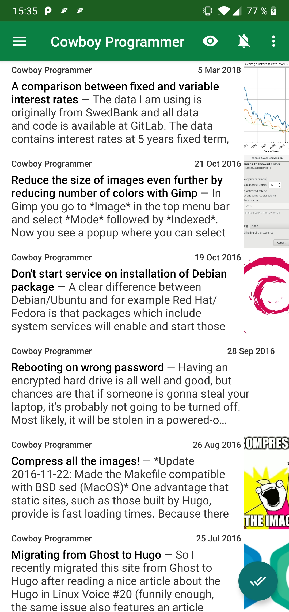
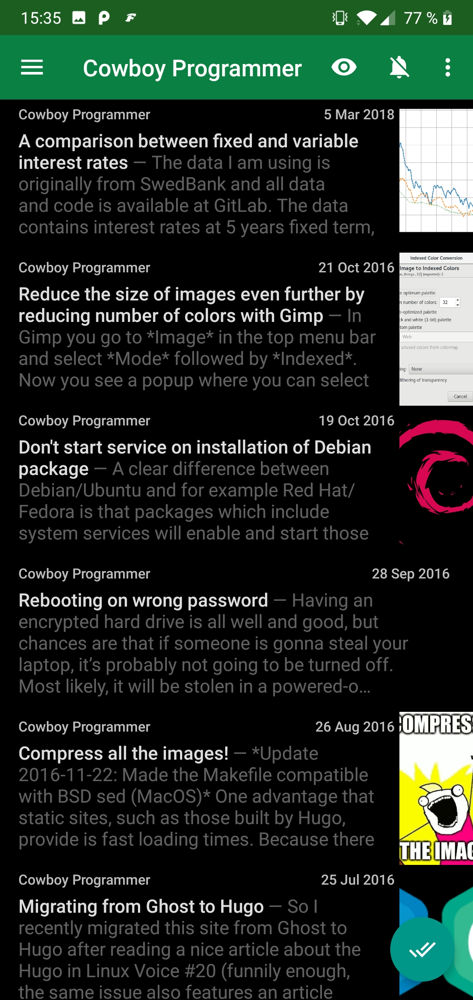
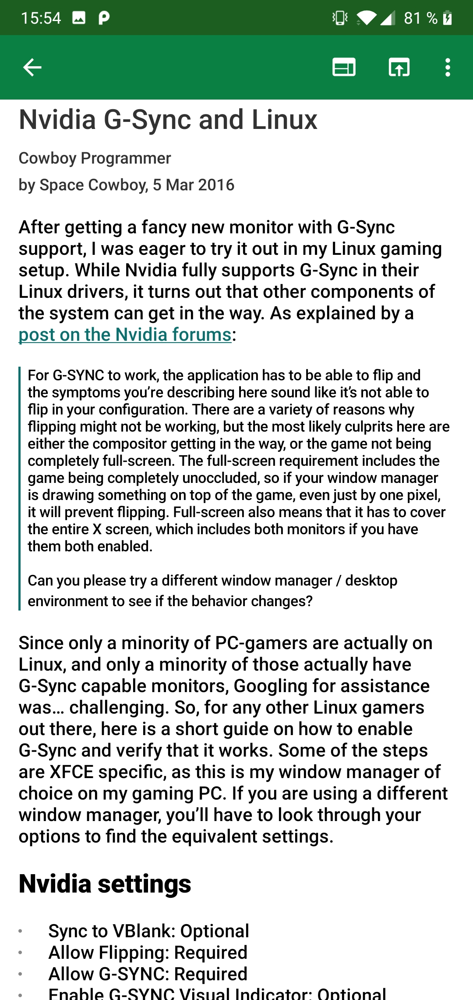
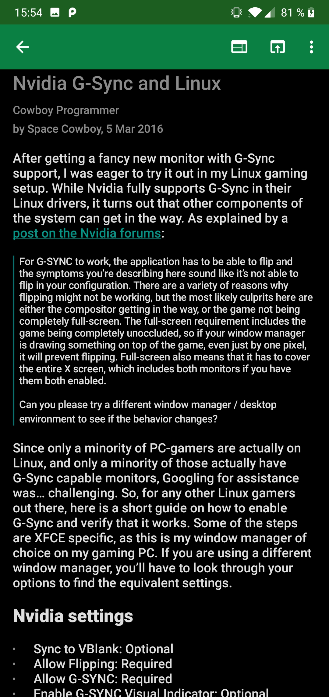
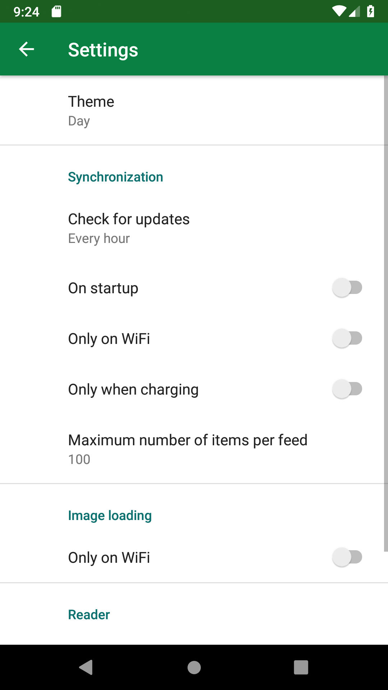
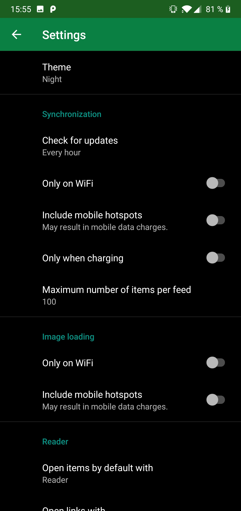

Feeder
=====

### License

**GPLv3**, for more info see *LICENSE*.

### Quick install

Clone the project:

    git clone --recursive https://github.com/spacecowboy/Feeder.git

Then build and install the app to your phone which is connected via USB:

    ./gradlew installDebug

### More details

This is a no-nonsense RSS/Atom/JSON feed reader app for Android.

### Features

* Offline reading
* Notification support
* OPML Import/Export
* Material design

### Screenshots

